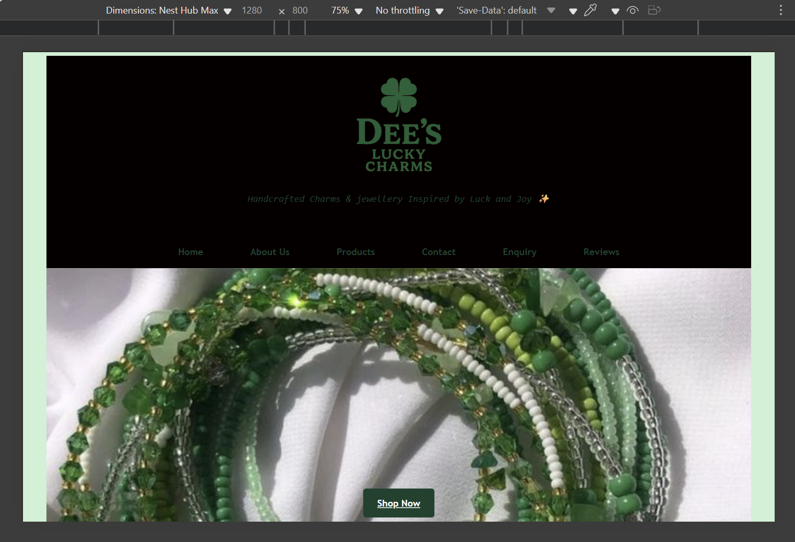

# 1.Project title
Dee's lucky charmns

# 2. Student information
Dineo Tukakgomo
ST10490306
WEDE5020 POE Part 1

# 3. Github repository link
https://github.com/DeeNeoo/deesLuckyCharms/tree/master

# 4. Website goals and objectives

## Goals
Generate high-quality leads via quote requests.
Increase online sales by 50% within 6 months.
Build brand awareness and customer loyalty.
Provide educational content about charm meanings and styling options.
Sell more products like necklaces, rings etc

## Objectives
Implement a Google Form for newsletter subscription, lead generation, and quotation enquiries.
Integrate PayFast payment gateway for seamless checkout.
Post on Instagram and TikTok with weekly posts on charm meanings, styling tips, and cultural symbolism.
Introduce loyalty discounts and referral programs to encourage repeat customers.
Optimise SEO and social media campaigns to increase traffic and visibility.

# 5. Key features and functionality
1. My website has a clear, user friendly navigation structure.
2. Products are well shown in the products page and the have captions to captivate potential clients to buy.

# 6. Timeline and milestones
| **Milestone**            | **Date (dd/mm/yyyy)**   |
| ------------------------ | ----------------------- |
| Proposal Approved        | 07/08/2025              |
| Wireframe & Design Draft | 10/08/2025 – 12/08/2025 |
| Development Phase        | 13/08/2025 – 22/08/2025 |
| Testing and Feedback     | 23/08/2025 – 26/08/2025 |
| Final Launch             | 01/09/2025              |

# 7. Site map

# 8.Change log

#### Added
###### 1. Sitemap:
Added a better sitemap to make the website easier to use and navigate.  
###### 2. Page Content:
Added more content on the Contact us and Enquiries page. This content improves clarity for users seeking assistance or submitting quiries, ensuringbetter communucation and engagement.

#### Changed
###### 1. Home page file:
Renamed index_homepage.html to index.html to follow the standard namimg conventions.
###### 2. HeroShot visual:
Replaced the initial heroShot with a new image to create a more applealing and modern first impression on the homepage.
###### 3. HTML structure fixes:
Moved the navigation code into the <header> section of the HTML. This aligns the site with good semantic practices.
###### 4. <centre> tags
Removed the <centre> tags used to align the logo and replaced them with CSS-based alignment that allows easier styling and responsiveness.

# 9.Test and iteration
## 1. Smart phone/small screen

home page:

products page:

About us page:

Contact us page:

Enquiries page:

Reviews page:

## 2.Tablets or medium screens

homepage:

Products page:

Contact us page:

About us page:

Enquiries page:

Reviews page:

## 3. Desktop/ big screens

Home page:

Products page:

About us page:

Contact us page:

Enquiries page:

Reviews page:

# 10. References

Adobe, 2023. Best practices for eCommerce UX. Adobe XD Ideas.

Afrihost, 2025. Web Hosting Prices. [online] Available at: https://www.afrihost.com [Accessed 10 Aug. 2025].

Balsamiq, 2025. Wireframing Tool. [online] Available at: https://balsamiq.com [Accessed 10 Aug. 2025].

Canva, 2025. Website Wireframe Templates. [online] Available at: https://www.canva.com/website/wireframes/ [Accessed 11 Aug. 2025].

Coolors, 2024. Color Palette Generator. [online] Available at: https://coolors.co [Accessed 11 Aug. 2025].

Domains.co.za, 2025. Domain Pricing. [online] Available at: https://www.domains.co.za [Accessed 10 Aug. 2025].

Figma, 2025. Wireframing in Figma. [online] Available at: https://help.figma.com [Accessed 11 Aug. 2025].

Google Fonts, 2024. Playfair Display and Open Sans. [online] Available at: https://fonts.google.com [Accessed 10 Aug. 2025].

Nielsen Norman Group, 2023. Usability Heuristics. [online] Available at: https://www.nngroup.com [Accessed 10 Aug. 2025].

PayFast, 2025. Pricing and Supported Platforms. [online] Available at: https://www.payfast.co.za [Accessed 11 Aug. 2025].

Shopify, 2024. How to Start a Jewelry Business. Shopify Blog.

Statista, 2024. South Africa: eCommerce Market Revenue. [online] Available at: https://www.statista.com/outlook/dmo/ecommerce/south-africa [Accessed 15 Aug. 2025].

Afrihost, 2025. Web Hosting Prices. [online] Available at: https://www.afrihost.com [Accessed 7 Aug. 2025].

Domains.co.za, 2025. Domain Name Pricing. [online] Available at: https://www.domains.co.za [Accessed 7 Aug. 2025].

Nielsen Norman Group, 2023. 10 Usability Heuristics for User Interface Design. [online] Available at: https://www.nngroup.com/articles/ten-usability-heuristics/ [Accessed 7 Aug. 2025].

Mozilla Developer Network (MDN), 2024. HTML, CSS, and JavaScript Guide. [online] Available at: https://developer.mozilla.org [Accessed 7 Aug. 2025].

WordPress, 2025. WPForms Plugin. [online] Available at: https://wpforms.com [Accessed 7 Aug. 2025].

Xneelo, 2025. Web Hosting Options. [online] Available at: https://xneelo.co.za [Accessed 7 Aug. 2025].

Pinterest, 2025. Green beaded bracelets with four-leaf clover charms. [image] Available at: https://www.pinterest.com [Accessed 22 Aug. 2025].

Pinterest, 2025. White marbled bracelet with gold-toned heart charm. [image] Available at: https://www.pinterest.com [Accessed 20 Aug. 2025].

Pinterest, 2025. Translucent white bracelet with silver dragonfly charm. [image] Available at: https://www.pinterest.com [Accessed 21 Aug. 2025].

Pinterest, 2025. Turquoise bracelet with silver elephant charm. [image] Available at: https://www.pinterest.com [Accessed 23 Aug. 2025].

Pinterest, 2025. Blue and black evil eye bracelet with Hamsa hand charm. [image] Available at: https://www.pinterest.com [Accessed 20 Aug. 2025].

Pinterest, 2025. Pink and grey bracelet with butterfly and lotus flower charms. [image] Available at: https://www.pinterest.com [Accessed 25 Aug. 2025].

Pinterest, 2025. Multicolor bracelet with lava stones and rose gold beads. [image] Available at: https://www.pinterest.com [Accessed 23 Aug. 2025].

Pinterest, 2025. White howlite bracelet with metallic centerpiece. [image] Available at: https://www.pinterest.com [Accessed 22 Aug. 2025].

Pinterest, 2025. White marble-style bracelet with gray veining. [image] Available at: https://www.pinterest.com [Accessed 22 Aug. 2025].

Pinterest, 2025. Green waist beads design. [Pinterest] Available at: https://za.pinterest.com/pin/113434484358137366/ [Accessed: 20 September 2025].
W3Schools, 2024. CSS Media Queries. [online] Available at: https://www.w3schools.com/css/css_rwd_mediaqueries.asp [Accessed 20 September 2025].

Mozilla Developer Network (MDN), 2024. Responsive design. [online] Available at: https://developer.mozilla.org/en-US/docs/Learn/CSS/CSS_layout/Responsive_Design
 [Accessed 20 September 2025].

Stack Overflow, 2025. Questions tagged [css-flexbox]. [online] Available at: https://stackoverflow.com/questions/tagged/css-flexbox [Accessed 20 September 2025].

ChatGPT, 2025. Conversation with Dee on HTML and CSS fixes for “Dee’s Lucky Charms” website, 29 September. [online] Available at: OpenAI ChatGPT [Accessed 20 September 2025].

Pinterest, 2025. Black stone bracelet with seven Chakra beads [image] Available at: https://www.pinterest.com [Accessed 20 Aug. 2025].

Pinterest, 2025. Hematite bracelet [image] Available at: https://www.pinterest.com [Accessed 20 Aug. 2025].

Pinterest, 2025. Citrine bracelet [image] Available at: https://www.pinterest.com [Accessed 20 Aug. 2025].

Pinterest, 2025. Tigers eye Bracelet [image] Available at: https://www.pinterest.com [Accessed 20 Aug. 2025].

