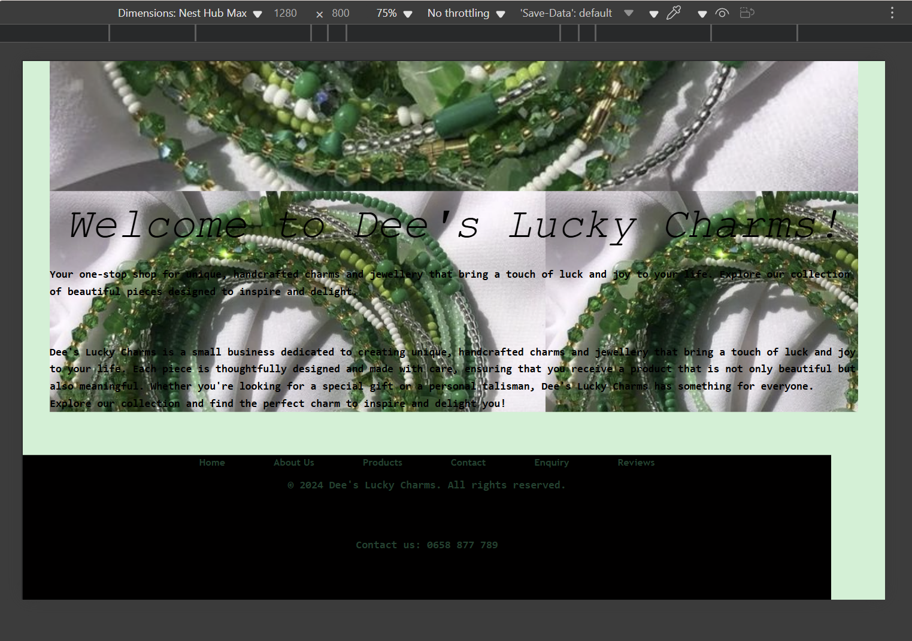

# 1.Project title
Dee's lucky charmns

# 2. Student information
Dineo Tukakgomo
ST10490306
WEDE5020 POE Part 1

# 3. Github repository link
https://github.com/DeeNeoo/deesLuckyCharms/tree/master

# 4. Website goals and objectives

## Goals
Generate high-quality leads via quote requests.
Increase online sales by 50% within 6 months.
Build brand awareness and customer loyalty.
Provide educational content about charm meanings and styling options.
Sell more products like necklaces, rings etc

## Objectives
Implement a Google Form for newsletter subscription, lead generation, and quotation enquiries.
Integrate PayFast payment gateway for seamless checkout.
Post on Instagram and TikTok with weekly posts on charm meanings, styling tips, and cultural symbolism.
Introduce loyalty discounts and referral programs to encourage repeat customers.
Optimise SEO and social media campaigns to increase traffic and visibility.

# 5. Key features and functionality
1. My website has a clear, user friendly navigation structure.
2. Products are well shown in the products page and the have captions to captivate potential clients to buy.

# 6. Timeline and milestones
| **Milestone**            | **Date (dd/mm/yyyy)**   |
| ------------------------ | ----------------------- |
| Proposal Approved        | 07/08/2025              |
| Wireframe & Design Draft | 10/08/2025 – 12/08/2025 |
| Development Phase        | 13/08/2025 – 22/08/2025 |
| Testing and Feedback     | 23/08/2025 – 26/08/2025 |
| Final Launch             | 01/09/2025              |

# 7. Site map

# 8.Change log

#### Added
###### 1. Sitemap:
Added a better sitemap to make the website easier to use and navigate.  
###### 2. Page Content:
Added more content on the Contact us and Enquiries page. This content improves clarity for users seeking assistance or submitting quiries, ensuringbetter communucation and engagement.

#### Changed
###### 1. Home page file:
Renamed index_homepage.html to index.html to follow the standard namimg conventions.
###### 2. HeroShot visual:
Replaced the initial heroShot with a new image to create a more applealing and modern first impression on the homepage.
###### 3. HTML structure fixes:
Moved the navigation code into the <header> section of the HTML. This aligns the site with good semantic practices.
###### 4. <centre> tags
Removed the <centre> tags used to align the logo and replaced them with CSS-based alignment that allows easier styling and responsiveness.

# POE Part 2 Feedback updates
#### Added:
###### Complete pseudo-class support for navigation menus:
:link - Default state for unvisited navigation links
:visited - Dark olive green color for previously visited links
:hover - Enhanced hover effects with background color, transform lift, and shadow
:active - Active state feedback with color change and transform reset
:focus - Accessibility-focused outline states for keyboard navigation

#### Enhanced
###### Navigation Links:
Added consistent padding (0.5rem 1rem) to all navigation links
Implemented border-radius (4px) for better visual appearance
Added smooth transitions (all 0.3s ease) for all interactive states
Set display: inline-block to enable transform effects

###### Current Page Indicator:
Improved contrast with light text on dark background
Added !important declarations to ensure state precedence
Enhanced visual hierarchy with bold font weight

###### Call-to-Action Buttons:
Added proper pseudo-class support for CTA buttons
Implemented hover transform effects and shadow
Added focus states for accessibility
Included active state feedback

###### Form Elements:
Added :focus states for form inputs and textareas
Enhanced form buttons with hover, active, and focus states
Improved visual feedback with outline and box-shadow effects

#### Accessibility
###### Focus Indicators:
Added clear outline styles for all interactive elements
Implemented outline-offset for better visibility
Used consistent focus colors matching the design system

###### Keyboard Navigation:
Enhanced focus states for both top and bottom navigation
Added focus support for form elements and buttons

#### Visual Improvements
###### Interactive Feedback:
Transform effects (translateY(-2px)) on hover for "lift" effect
Box shadows for depth perception
Background color changes for state differentiation
Smooth state transitions throughout

###### Color Consistency:
Maintained brand color palette across all states
Used semantic color changes for different states
Ensured proper contrast ratios for accessibility

###### Technical
#### CSS Structure:
Organized pseudo-classes in LVHA order (Link, Visited, Hover, Active)
Maintained proper specificity throughout
Added comprehensive comments for navigation sections

#### Fixed:
Responsive breakpoints across all major device sizes, including small phones, tablets, and laptops.

#### Details:
Adjusted CSS media queries to ensure consistent layout behavior and proper scaling of text, images, and navigation elements.
Ensured that navigation automatically switches to a vertical layout on smaller screens and displays horizontally on laptops and larger devices.
Optimized margins, padding, and font sizes for better readability and spacing on all screen resolutions.
Verified that all sections of the webpage (header, hero section, content areas, and footer) align properly and maintain visual balance across breakpoints.

#### Result: 
The website is now fully responsive — content dynamically adapts to different screen sizes, providing an improved and consistent user experience across mobile, tablet, and desktop devices.

#### Examples:
small screen

medium screen

big screen

# 9.Test and iteration
## 1. Smart phone/small screen

home page:

products page:

About us page:

Contact us page:

Enquiries page:

Reviews page:

## 2.Tablets or medium screens

homepage:

Products page:

Contact us page:

About us page:

Enquiries page:

Reviews page:

## 3. Desktop/ big screens

Home page:

Products page:

About us page:

Contact us page:

Enquiries page:

Reviews page:

# 10. References

Adobe, 2023. Best practices for eCommerce UX. Adobe XD Ideas.

Afrihost, 2025. Web Hosting Prices. [online] Available at: https://www.afrihost.com [Accessed 10 Aug. 2025].

Balsamiq, 2025. Wireframing Tool. [online] Available at: https://balsamiq.com [Accessed 10 Aug. 2025].

Canva, 2025. Website Wireframe Templates. [online] Available at: https://www.canva.com/website/wireframes/ [Accessed 11 Aug. 2025].

Coolors, 2024. Color Palette Generator. [online] Available at: https://coolors.co [Accessed 11 Aug. 2025].

Domains.co.za, 2025. Domain Pricing. [online] Available at: https://www.domains.co.za [Accessed 10 Aug. 2025].

Figma, 2025. Wireframing in Figma. [online] Available at: https://help.figma.com [Accessed 11 Aug. 2025].

Google Fonts, 2024. Playfair Display and Open Sans. [online] Available at: https://fonts.google.com [Accessed 10 Aug. 2025].

Nielsen Norman Group, 2023. Usability Heuristics. [online] Available at: https://www.nngroup.com [Accessed 10 Aug. 2025].

PayFast, 2025. Pricing and Supported Platforms. [online] Available at: https://www.payfast.co.za [Accessed 11 Aug. 2025].

Shopify, 2024. How to Start a Jewelry Business. Shopify Blog.

Statista, 2024. South Africa: eCommerce Market Revenue. [online] Available at: https://www.statista.com/outlook/dmo/ecommerce/south-africa [Accessed 15 Aug. 2025].

Afrihost, 2025. Web Hosting Prices. [online] Available at: https://www.afrihost.com [Accessed 7 Aug. 2025].

Domains.co.za, 2025. Domain Name Pricing. [online] Available at: https://www.domains.co.za [Accessed 7 Aug. 2025].

Nielsen Norman Group, 2023. 10 Usability Heuristics for User Interface Design. [online] Available at: https://www.nngroup.com/articles/ten-usability-heuristics/ [Accessed 7 Aug. 2025].

Mozilla Developer Network (MDN), 2024. HTML, CSS, and JavaScript Guide. [online] Available at: https://developer.mozilla.org [Accessed 7 Aug. 2025].

WordPress, 2025. WPForms Plugin. [online] Available at: https://wpforms.com [Accessed 7 Aug. 2025].

Xneelo, 2025. Web Hosting Options. [online] Available at: https://xneelo.co.za [Accessed 7 Aug. 2025].

Pinterest, 2025. Green beaded bracelets with four-leaf clover charms. [image] Available at: https://www.pinterest.com [Accessed 22 Aug. 2025].

Pinterest, 2025. White marbled bracelet with gold-toned heart charm. [image] Available at: https://www.pinterest.com [Accessed 20 Aug. 2025].

Pinterest, 2025. Translucent white bracelet with silver dragonfly charm. [image] Available at: https://www.pinterest.com [Accessed 21 Aug. 2025].

Pinterest, 2025. Turquoise bracelet with silver elephant charm. [image] Available at: https://www.pinterest.com [Accessed 23 Aug. 2025].

Pinterest, 2025. Blue and black evil eye bracelet with Hamsa hand charm. [image] Available at: https://www.pinterest.com [Accessed 20 Aug. 2025].

Pinterest, 2025. Pink and grey bracelet with butterfly and lotus flower charms. [image] Available at: https://www.pinterest.com [Accessed 25 Aug. 2025].

Pinterest, 2025. Multicolor bracelet with lava stones and rose gold beads. [image] Available at: https://www.pinterest.com [Accessed 23 Aug. 2025].

Pinterest, 2025. White howlite bracelet with metallic centerpiece. [image] Available at: https://www.pinterest.com [Accessed 22 Aug. 2025].

Pinterest, 2025. White marble-style bracelet with gray veining. [image] Available at: https://www.pinterest.com [Accessed 22 Aug. 2025].

Pinterest, 2025. Green waist beads design. [Pinterest] Available at: https://za.pinterest.com/pin/113434484358137366/ [Accessed: 20 September 2025].
W3Schools, 2024. CSS Media Queries. [online] Available at: https://www.w3schools.com/css/css_rwd_mediaqueries.asp [Accessed 20 September 2025].

Mozilla Developer Network (MDN), 2024. Responsive design. [online] Available at: https://developer.mozilla.org/en-US/docs/Learn/CSS/CSS_layout/Responsive_Design
 [Accessed 20 September 2025].

Stack Overflow, 2025. Questions tagged [css-flexbox]. [online] Available at: https://stackoverflow.com/questions/tagged/css-flexbox [Accessed 20 September 2025].

ChatGPT, 2025. Conversation with Dee on HTML and CSS fixes for “Dee’s Lucky Charms” website, 29 September. [online] Available at: OpenAI ChatGPT [Accessed 20 September 2025].

Pinterest, 2025. Black stone bracelet with seven Chakra beads [image] Available at: https://www.pinterest.com [Accessed 20 Aug. 2025].

Pinterest, 2025. Hematite bracelet [image] Available at: https://www.pinterest.com [Accessed 20 Aug. 2025].

Pinterest, 2025. Citrine bracelet [image] Available at: https://www.pinterest.com [Accessed 20 Aug. 2025].

Pinterest, 2025. Tigers eye Bracelet [image] Available at: https://www.pinterest.com [Accessed 20 Aug. 2025].

Pinterest, 2025. smiley charm bracelet. [image] Available at: https://www.pinterest.com [Accessed 01 Nov. 2025].

Pinterest, 2025. white marble bracelet. [image] Available at: https://www.pinterest.com [Accessed 01 Nov. 2025].

W3Schools (n.d.) JavaScript Date Methods. Available at: https://www.w3schools.com/jsref/jsref_obj_date.asp (Accessed: 1 November 2025).

W3Schools (n.d.) HTML <title> Tag. Available at: https://www.w3schools.com/tags/tag_title.asp (Accessed: 1 November 2025).

W3Schools (n.d.) HTML <meta> Tag. Available at: https://www.w3schools.com/tags/tag_meta.asp (Accessed: 1 November 2025).

W3Schools (n.d.) CSS Animations. Available at: https://www.w3schools.com/css/css3_animations.asp (Accessed: 1 November 2025).

W3Schools (n.d.) CSS Flexbox. Available at: https://www.w3schools.com/css/css3_flexbox.asp (Accessed: 1 November 2025).

Lee, E. (2021) Dissecting the Pure CSS Lightbox. Available at: https://develijahlee.medium.com/dissecting-the-pure-css-lightbox-cd8de94e48c1 (Accessed: 1 November 2025 )

